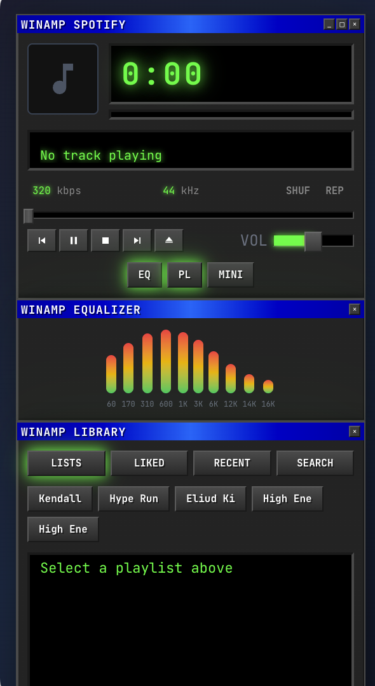

<p align="center">
  
</p>

<h1 align="center">
  <code>WINAMP SPOTIFY</code>
</h1>

<p align="center">
  <em>"Nostalgia — it's delicate, but potent."</em>
</p>

<p align="center">
  <strong>A time machine for 90s kids.</strong><br/>
  Taking you back to a place where you know you are loved.
</p>

<p align="center">
  <a href="#inspiration">Inspiration</a> •
  <a href="#features">Features</a> •
  <a href="#quick-start">Quick Start</a> •
  <a href="#spotify-setup">Spotify Setup</a> •
  <a href="#troubleshooting">Troubleshooting</a>
</p>

<p align="center">
  
  
  
</p>

---

## Inspiration

<p align="center">
  <a href="https://www.youtube.com/watch?v=suRDUFpsHus">
    
  </a>
</p>

<p align="center">
  <em>Click to watch: <strong>Mad Men — The Carousel</strong></em>
</p>

This project is an ode to the 90s kids — a digital time machine built to transport you back to an era of dial-up modems, burned CDs, and carefully curated MP3 collections.

Winamp wasn't just software. It was a ritual. The green LED glow illuminating your face at 2 AM. The spectrum analyzer dancing to your favorite songs. The skins you spent hours customizing instead of doing homework.

For those of us who grew up in that era, music wasn't just something you streamed — it was something you *collected*, organized, and cherished. Every track had a story. Every playlist was a time capsule.

This project exists because some of us still feel that twinge — that ache to go back. Not to relive the past, but to feel it again, just for a moment.

*It's not called the Wheel. It's called the Carousel. It lets us travel the way a child travels — around and around, and back home again, to a place where we know we are loved.*

---

## Features

<p align="center">
  
</p>

| Feature | Description |
|---------|-------------|
| **Classic Aesthetic** | Pixel-perfect Winamp 2.x recreation with LED displays, spectrum analyzer, and metallic buttons |
| **Album Art** | See album artwork alongside the time display |
| **Full Playback Control** | Play, pause, next, previous, seek, volume, shuffle, repeat |
| **Library Tabs** | Browse your Playlists, Liked Songs, Recently Played, or Search |
| **Visual Equalizer** | Decorative 10-band EQ for that authentic look |
| **Device Selector** | Control Spotify on any of your connected devices |
| **Mini Mode** | Compact view showing just the player |
| **Desktop App** | Runs as a native macOS app via Electron |

---

## Quick Start

### Prerequisites

- **Node.js 18+**
- **Spotify Premium** account (required for playback)
- **Spotify Developer App** ([create one here](https://developer.spotify.com/dashboard))

### Installation

```bash
# Clone the repository
git clone https://github.com/YOUR_USERNAME/winamp-spotify.git
cd winamp-spotify

# Install dependencies
npm install

# Create environment file
echo "NEXT_PUBLIC_SPOTIFY_CLIENT_ID=your_client_id_here" > .env.local

# Run in browser
npm run dev

# Or run as desktop app
npm run electron:dev
```

Then open **http://127.0.0.1:3000** in your browser.

---

## Spotify Setup

<details>
<summary><strong>Step-by-step guide</strong> (click to expand)</summary>

### 1. Create a Spotify App

1. Go to the [Spotify Developer Dashboard](https://developer.spotify.com/dashboard)
2. Click **"Create App"**
3. Fill in the details:

| Field | Value |
|-------|-------|
| App name | `Winamp Spotify` |
| App description | `Retro music player` |
| Redirect URI | `http://127.0.0.1:3000/callback` |
| APIs used | ✓ Web API, ✓ Web Playback SDK |

4. Click **"Save"**
5. Go to **Settings** → copy your **Client ID**

### 2. Configure the App

Create a `.env.local` file in the project root:

```env
NEXT_PUBLIC_SPOTIFY_CLIENT_ID=paste_your_client_id_here
```

### 3. Run It

```bash
npm run electron:dev
```

</details>

---

## Usage

### Browser Mode
```bash
npm run dev
# Open http://127.0.0.1:3000
```

### Desktop App (Electron)
```bash
npm run electron:dev
```

### Build for Production

```bash
# Web build
npm run build && npm run start

# macOS DMG
npm run electron:build
```

---

## How It Works

The app operates in two modes depending on your setup:

| Access URL | Mode | Description |
|------------|------|-------------|
| `127.0.0.1` | **Spotify Connect** | Controls playback on your other Spotify devices |
| `localhost` | **Web Playback SDK** | Plays directly in browser (requires localhost in redirect URIs) |

---

## Project Structure

```
winamp-spotify/
├── src/
│   ├── app/
│   │   ├── page.tsx           # Main page
│   │   ├── callback/          # OAuth callback
│   │   ├── layout.tsx         # App layout
│   │   └── globals.css        # Winamp styles
│   ├── components/
│   │   └── WinampPlayer.tsx   # Player UI (700+ lines of nostalgia)
│   ├── hooks/
│   │   └── useSpotify.ts      # Spotify state & SDK
│   └── lib/
│       └── spotify.ts         # API functions
├── electron/
│   ├── main.js                # Electron main process
│   └── preload.js             # Preload script
└── package.json
```

---

## Troubleshooting

<details>
<summary><strong>INVALID_CLIENT: Invalid redirect URI</strong></summary>

Ensure your Spotify Dashboard redirect URI **exactly matches**:
```
http://127.0.0.1:3000/callback
```
No trailing slash. Case-sensitive.
</details>

<details>
<summary><strong>No code verifier found</strong></summary>

This happens when you start auth on one origin (localhost) and finish on another (127.0.0.1).

**Solution**: Always use `http://127.0.0.1:3000` consistently.
</details>

<details>
<summary><strong>Failed to initialize player</strong></summary>

The Web Playback SDK only works on `localhost` or HTTPS. When accessing via `127.0.0.1`, the app automatically falls back to Spotify Connect mode—make sure you have Spotify open on another device.
</details>

<details>
<summary><strong>Playback not working</strong></summary>

- Verify you have **Spotify Premium**
- Have Spotify open on another device (for Connect mode)
- Try logging out and back in
- Check browser console for errors
</details>

---

## Tech Stack

| Layer | Technology |
|-------|------------|
| Framework | [Next.js 16](https://nextjs.org/) |
| Styling | [Tailwind CSS 4](https://tailwindcss.com/) |
| Desktop | [Electron 39](https://www.electronjs.org/) |
| Font | [JetBrains Mono](https://www.jetbrains.com/lp/mono/) |
| API | [Spotify Web API](https://developer.spotify.com/documentation/web-api) |
| SDK | [Spotify Web Playback SDK](https://developer.spotify.com/documentation/web-playback-sdk) |

---

## License

MIT

---

<p align="center">
  <sub>Original Winamp by Nullsoft • Spotify is a trademark of Spotify AB</sub>
</p>

<p align="center">
  <strong>For the 90s kids. For the memories. For the music.</strong>
</p>
